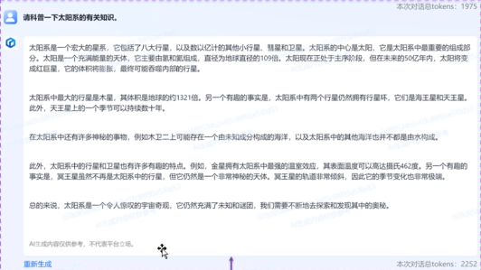
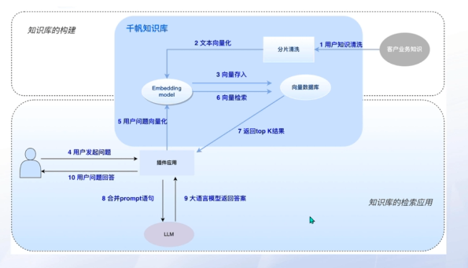

# 大语言模型实践
## 模型下载
### huggingface
模型文件通常都很大，除了一些模型会发布在github上，大多数都会发布在huggingface上。
除了在网站上手工下载，推荐通过huggingface的python工具下载。
安装方法:
```
pip install huggingface_hub
```
使用方法
1. 在命令行中：
```
export HF_ENDPOINT=https://hf-mirror.com
huggingface-cli download --resume-download internlm/internlm-chat-7b --local-dir your_path
```
export HF_ENDPOINT=https://hf-mirror.com：国内网络不好，必须通过镜像访问
resume-download：断点续下
local-dir：本地存储路径。（linux 环境下需要填写绝对路径）
internlm/internlm-chat-7b：模型名称

2. 在python代码中：
```python
import os
os.environ['HF_ENDPOINT'] = 'https://hf-mirror.com'
os.system('huggingface-cli download --resume-download internlm/internlm-chat-7b --local-dir your_path')
```
### 其它模型网站
国内比较有名的是modelscope魔搭社区(www.modelscope.cn)。
上海本地的有上海大数据中心的openxlab浦源(openxlab.org.cn)。
与huggingface类似，都提供了python工具下载，具体方法参见这两个网站的说明文档。
## 大语言模型
### 大语言模型的参数
模型文件一般都有个数字表示参数数量,例如internlm-chat-7b，就是7billion个参数。  
每个参数使用单精度浮点(float16)表示，就需要2个字节。因此，7b的模型至少需要14G的显存。  
对于个人来说大于10B的模型基本不可能有条件运行起来。    
以下都是在2024年3月6日时，小于10B的最新的开源模型：
1. 上海大数据中心-internlm(浦语)，internlm/internlm2-chat-7b
2. 清华大学-chatglm(智谱清言)，ZhipuAI/chatglm3-6b
3. 阿里巴巴-qwen(通义千问)，qwen/Qwen1.5-7B-Chat
## 提示词工程
### 提示词(prompt)对结果的影响([视频](https://cloud.baidu.com/partner/course-center/course.html?id=686))
#### 第一个例子

#### 第二个例子



### 提示词(prompt)总原则([视频](https://cloud.baidu.com/partner/course-center/course.html?id=687))
  
提示词(prompt)万能公式  
  
举例  

### 提示词(prompt)策略([视频](https://cloud.baidu.com/partner/course-center/course.html?id=689))
#### 技巧1 提示提不要太笼统  

#### 技巧2 让大模型扮演一个角色  

#### 技巧3 恰当地使用分隔符
  

#### 技巧4 指定完成任务所需的技巧的步骤  

#### 技巧5 提供例子  

#### 技巧6 指定输出长度  

#### 技巧7 限定长度  

## 大语言模型在行业应用
### 1. 检索增强生成(RAG,Retrieval-Augmented Generation)
工具(langchain)+知识库
langchain是开源的python库。
#### 知识库解决了什么问题?([视频](https://cloud.baidu.com/partner/course-center/course.html?id=710))
  
#### 知识库的工作流程

#### 知识库的逻辑关系

### 2. 微调(Fine-Tuning)
构建行业或者专属领域大模型的方法就是微调。
大模型训练的三个阶段([视频](https://cloud.baidu.com/partner/course-center/course.html?id=722))

基于大模型的微调，有三处位置
1. 后期预训练Post-pretraining,在Pre-training完成后的大模型基础上进行。
Post-pretraining与Pre-training的区别

数据准备([视频](https://cloud.baidu.com/partner/course-center/course.html?id=723))

2. 有监督精调SFT([视频](https://cloud.baidu.com/partner/course-center/course.html?id=729))
- 模型在有标注的数据集上进行进一步训练
- 往往采用特定领域、特定任务相关的数据
训练方法
- 全量微调：训练过程中对大模型的全部参数进行更新
- LoRA：固定预训练大模型本身的参数，只更新权重矩阵中低秩部分的参数
SFT数据要求([视频](https://cloud.baidu.com/partner/course-center/course.html?id=731))
- 数据格式：1.多轮对话-非排序类。2.问答形式
- 数据规模：通常上千条左右的精标数据就可以发挥良好的效果
- 数据质量：数据质量非常重要。多样性的数据可以提高模型性能。答案需真实。信息需无害。
数据格式举例

3. 人类反馈学习RLHF([视频](https://cloud.baidu.com/partner/course-center/course.html?id=717))
RLHF流程

    1. 奖励模型数据要求([视频](https://cloud.baidu.com/partner/course-center/course.html?id=718))
    - 奖励模型支持单轮对话、多轮对话有排序数据
    - 建议数据集总条数在1000条以上，训练模型更加精准
    举例，根据新闻内容生成标题的大模型的2条训练数据：
      
    response中有2个输出结果，最优的在前面  
    2. 强化学习数据要求([视频](https://cloud.baidu.com/partner/course-center/course.html?id=720))
      
    可以看到数据中只需要prompt。
    我理解的工作机制是：模型会使用强化学习的数据生成答案，然后与奖励模型的数据和答案比较，算出误差。通过多轮学习，逐步减小这个误差。

## 大模型的学习资料
1.  [面向开发者的 LLM 入门课程](https://github.com/datawhalechina/prompt-engineering-for-developers.git)